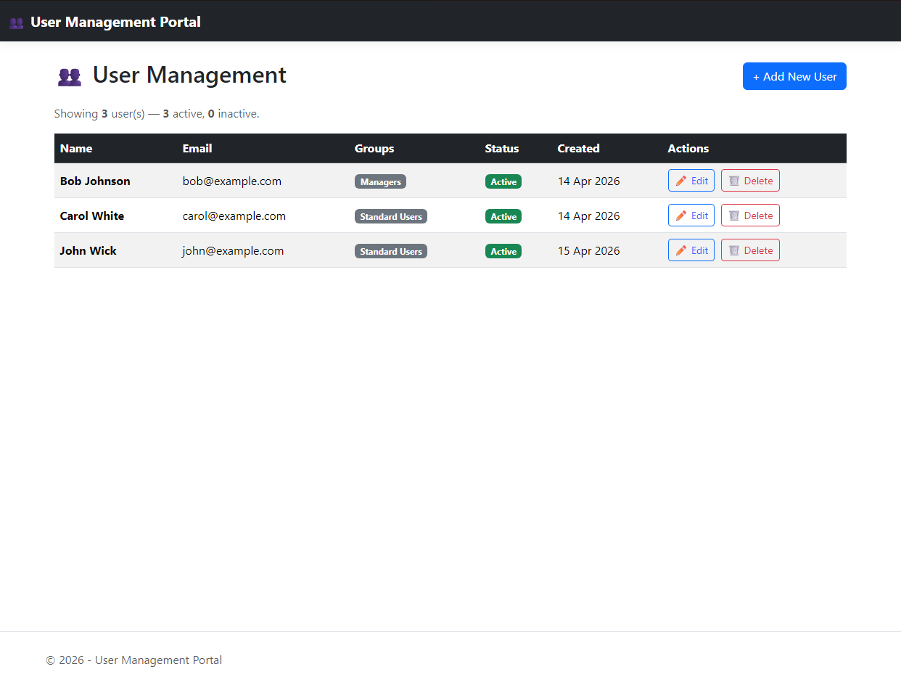
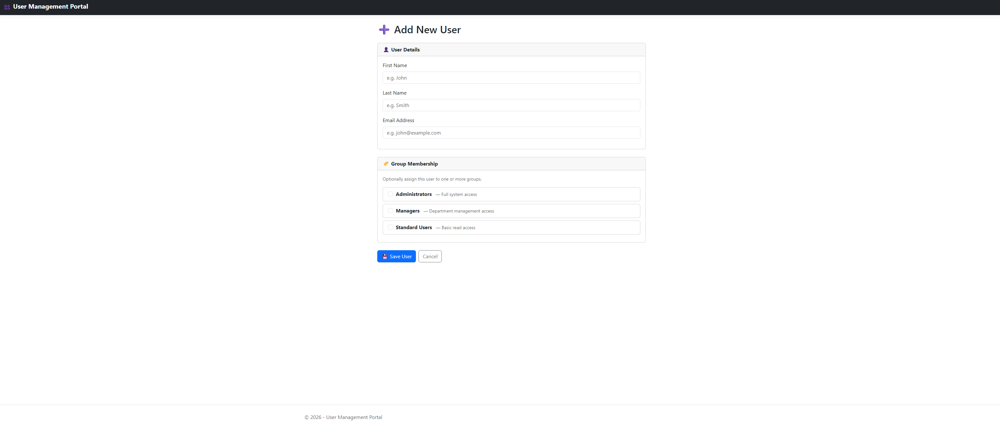
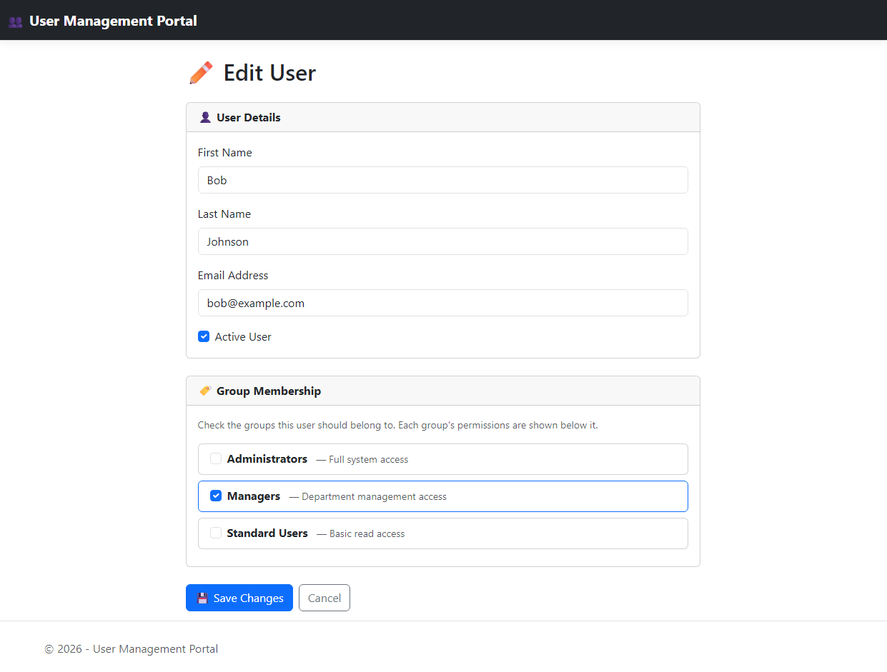
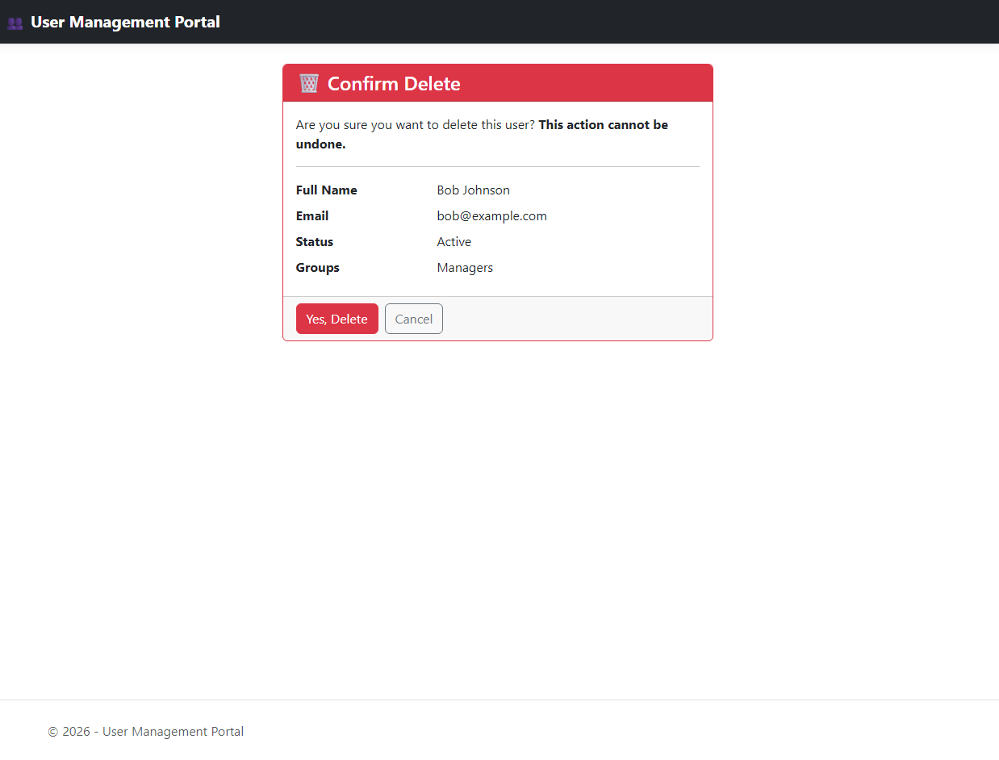
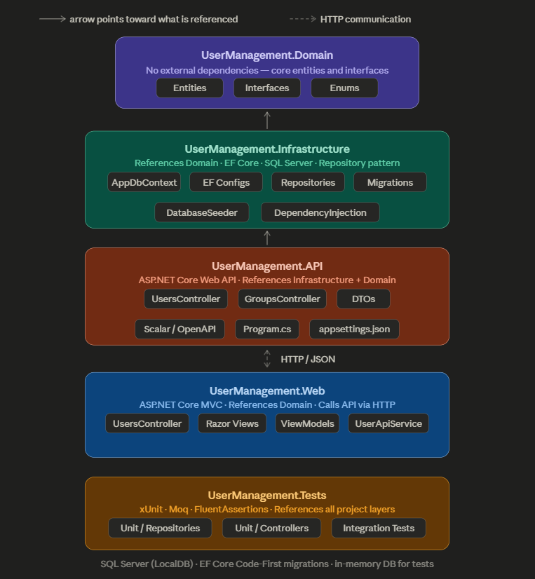

# 👥 User Management Portal

A full-stack user management application built with **Clean Architecture** in **.NET 10**.
Users can be created, edited, deleted, and assigned to groups through both a web interface and a REST API.

---

## 📸 Screenshots

<table>
  <tr>
    <td align="center">
      
      <br/><sub>User Management Portal</sub>
    </td>
    <td align="center">
      
      <br/><sub>Add New User</sub>
    </td>
  </tr>
  <tr>
    <td align="center">
      
      <br/><sub>Edit User &amp; Group Membership</sub>
    </td>
    <td align="center">
      
      <br/><sub>Delete Confirmation</sub>
    </td>
  </tr>
</table>

### Architecture Diagram



---

## 🏗️ Architecture

This solution follows **Clean Architecture (N-Tier)** with a strict one-direction dependency rule.
Each layer only references the layer directly above it — nothing references outward.

| Project | Responsibility |
|---|---|
| `UserManagement.Domain` | Entities, Interfaces, Enums — zero external dependencies |
| `UserManagement.Infrastructure` | EF Core DbContext, Repositories, Migrations, Seeder |
| `UserManagement.API` | ASP.NET Core Web API — REST endpoints, DTOs, Scalar docs |
| `UserManagement.Web` | ASP.NET Core MVC — Razor Views, ViewModels, HttpClient service |
| `UserManagement.Tests` | xUnit Unit Tests + Integration Tests — references all layers |

---

## 🛠️ Tech Stack

| Area | Technology |
|---|---|
| Framework | .NET 10 |
| API | ASP.NET Core Web API |
| Frontend | ASP.NET Core MVC (Razor Views) |
| Database | SQL Server (LocalDB) |
| ORM | Entity Framework Core 10 (Code First) |
| API Docs | Scalar / OpenAPI |
| Unit Testing | xUnit, Moq, FluentAssertions |
| Integration Testing | WebApplicationFactory + EF Core InMemory |

---

## ✅ Features

- ✅ User management — Add, Edit, Delete
- ✅ Group management with Permission levels (Level 1–5)
- ✅ Many-to-many User ↔ Group relationships
- ✅ Group membership managed directly on the Edit User page
- ✅ REST API with Scalar documentation
- ✅ Active / Inactive user status
- ✅ User count and users-per-group API endpoints
- ✅ Database seeding with sample data on first run
- ✅ Unit tests (Repository + Controller)
- ✅ Integration tests (full HTTP pipeline with in-memory database)

---

## 🚀 Getting Started

### Prerequisites

Make sure you have the following installed:

- [.NET 10 SDK](https://dotnet.microsoft.com/download/dotnet/10.0)
- [Visual Studio 2022](https://visualstudio.microsoft.com/) (v17.8 or later)
- [SQL Server Express / LocalDB](https://www.microsoft.com/en-us/sql-server/sql-server-downloads)
  - LocalDB is included automatically with Visual Studio
- [SSMS](https://learn.microsoft.com/en-us/sql/ssms/download-sql-server-management-studio-ssms) *(optional — for inspecting the database)*

---

### 1. Clone the Repository

```bash
git clone https://github.com/EmirGonuler/UserManagement.git
cd UserManagement
```

---

### 2. Verify the Connection String

Open `UserManagement.API/appsettings.json` and confirm the connection string:

```json
{
  "ConnectionStrings": {
    "DefaultConnection": "Server=(localdb)\\mssqllocaldb;Database=UserManagementDb;Trusted_Connection=True;MultipleActiveResultSets=true"
  }
}
```

> If you are using a full SQL Server instance, replace `(localdb)\\mssqllocaldb`
> with your server name, e.g. `Server=.\\SQLEXPRESS`.

---

### 3. Apply Database Migrations

Open **Package Manager Console** in Visual Studio:
**Tools → NuGet Package Manager → Package Manager Console**

Set the **Default project** dropdown to `UserManagement.Infrastructure`, then run:

```powershell
Update-Database -StartupProject UserManagement.API
```

This creates the `UserManagementDb` database with all tables.
Sample data is seeded automatically on first startup.

---

### 4. Configure Multiple Startup Projects

To run the API and Web frontend simultaneously:

1. Right-click the **Solution** → **Properties**
2. Select **Multiple startup projects**
3. Set both `UserManagement.API` and `UserManagement.Web` to **Start**
4. Click **OK**

---

### 5. Run the Application

Press **F5** in Visual Studio. Two browser windows will open:

| Project | Default URL |
|---|---|
| API (Scalar Docs) | `https://localhost:7227/scalar/v1` |
| Web Portal | `https://localhost:7096/users` |

> Your port numbers may differ. Check `Properties/launchSettings.json` in each project if the above URLs do not work.

---

### 6. Run the Tests

Open **Test Explorer** via **Test → Test Explorer**, then click **Run All**.

```
✅ UserManagement.Tests.Unit.Repositories   — 11 tests
✅ UserManagement.Tests.Unit.Controllers    —  9 tests
✅ UserManagement.Tests.Integration         —  8 tests
─────────────────────────────────────────────────────
✅ Total: 33 tests passed
```

> Integration tests use an **in-memory database** — no SQL Server connection needed.

---

## 📡 API Endpoints

### Users

| Method | Endpoint | Description |
|---|---|---|
| `GET` | `/api/users` | Get all users |
| `GET` | `/api/users/{id}` | Get user by ID |
| `GET` | `/api/users/count` | Get total active user count |
| `GET` | `/api/users/count-per-group` | Get user count per group |
| `POST` | `/api/users` | Create a new user |
| `PUT` | `/api/users/{id}` | Update an existing user |
| `DELETE` | `/api/users/{id}` | Delete a user |

### Groups

| Method | Endpoint | Description |
|---|---|---|
| `GET` | `/api/groups` | Get all groups |
| `GET` | `/api/groups/{id}` | Get group with permissions |
| `GET` | `/api/groups/{id}/users` | Get all users in a group |
| `POST` | `/api/groups/{groupId}/users/{userId}` | Add user to group |
| `DELETE` | `/api/groups/{groupId}/users/{userId}` | Remove user from group |

---

## 🗄️ Database Schema

```
Users                    Groups                Permissions
─────────────────        ──────────────        ───────────────────
Id           (PK)        Id         (PK)       Id          (PK)
FirstName                Name                  Name
LastName                 Description           Description
Email        (unique)    CreatedAt             Level       (enum)
IsActive                                       GroupId     (FK → Groups)
CreatedAt

                         UserGroups  (join table)
                         ────────────────────────
                         UserId      (FK → Users)
                         GroupId     (FK → Groups)
                         JoinedAt
```

---

## 📁 Project Structure

```
UserManagement.sln
├── UserManagement.Domain/
│   ├── Entities/           User, Group, Permission, UserGroup
│   ├── Interfaces/         IRepository<T>, IUserRepository, IGroupRepository
│   └── Enums/              PermissionLevel
│
├── UserManagement.Infrastructure/
│   ├── Data/               ApplicationDbContext, EF Configurations
│   ├── Repositories/       Repository<T>, UserRepository, GroupRepository
│   ├── Seeds/              DatabaseSeeder
│   └── Migrations/         EF Core Code-First migrations
│
├── UserManagement.API/
│   ├── Controllers/        UsersController, GroupsController
│   ├── DTOs/               CreateUserDto, UpdateUserDto, UserResponseDto
│   └── Program.cs
│
├── UserManagement.Web/
│   ├── Controllers/        UsersController
│   ├── Models/             ViewModels (Create, Update, User, Group)
│   ├── Services/           UserApiService
│   └── Views/Users/        Index, Create, Edit, Delete
│
└── UserManagement.Tests/
    ├── Unit/               UserRepositoryTests, UsersControllerTests
    └── Integration/        UsersApiIntegrationTests
```

